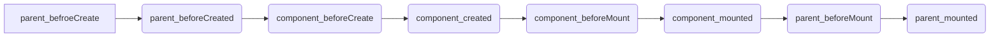
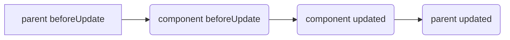
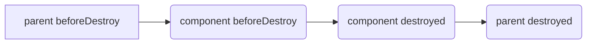

# props、methods、data、computed、watch初始化顺序

Vue在初始化事会调用`initState`方法
<!--more-->

```typescript
export function initState(vm: Component) {
  const opts = vm.$options
  if (opts.props) initProps(vm, opts.props)

  // Composition API
  initSetup(vm)
	// methods->data->computed->watch
  if (opts.methods) initMethods(vm, opts.methods)
  if (opts.data) {
    initData(vm)
  } else {
    const ob = observe((vm._data = {}))
    ob && ob.vmCount++
  }
  if (opts.computed) initComputed(vm, opts.computed)
  if (opts.watch && opts.watch !== nativeWatch) {
    initWatch(vm, opts.watch)
  }
}
```

- 从改方法中可以看出Vue初始化顺序：props->methods->data->computed->watch

# Prop允许使用哪些数据类型？

String、Number、Boolean、Array、Object、Date、Function、Symbol。 此外还可以是一个自定义的构造函数`Personnel`，并且通过 instanceof 来验证prop`wokrer`的值是否是通过这个自定义的构造函数创建的。

```js
function Personnel(name,age){
    this.name = name;
    this.age = age;
}
export default {
    props:{
        wokrer:Personnel
    }
}
```

# prop在default和validator函数中能用data和computed的数据吗？

不能，因为prop会在一个组件实例创建之前进行验证，所以data和computed在default或validator函数中是不可用的。

# computed watch和method区别

**computed**：默认`computed`也是一个`watcher`具备缓存，只有当依赖的数据变化时才会计算, 当数据没有变化时, 它会读取缓存数据。如果一个数据依赖于其他数据，使用` computed`

**watch**：每次都需要执行函数。 ` watch` 更适用于数据变化时的异步操作。如果需要在某个数据变化时做一些事情，使用watch。

**method**：只要把方法用到模板上了,每次一变化就会重新渲染视图，性能开销大

# v-if、v-for优先级

```js
export function genElement(el: ASTElement, state: CodegenState): string {
  if (el.parent) {
    el.pre = el.pre || el.parent.pre
  }

  if (el.staticRoot && !el.staticProcessed) {
    return genStatic(el, state)
  } else if (el.once && !el.onceProcessed) {
    return genOnce(el, state)
  } else if (el.for && !el.forProcessed) {
    return genFor(el, state)
  } else if (el.if && !el.ifProcessed) {
    return genIf(el, state)
  } else if (el.tag === 'template' && !el.slotTarget && !state.pre) {
    return genChildren(el, state) || 'void 0'
  } else if (el.tag === 'slot') {
    return genSlot(el, state)
  } else {
    // component or element
    let code
    if (el.component) {
      code = genComponent(el.component, el, state)
    } else {
      let data
      if (!el.plain || (el.pre && state.maybeComponent(el))) {
        data = genData(el, state)
      }

      const children = el.inlineTemplate ? null : genChildren(el, state, true)
      code = `_c('${el.tag}'${
        data ? `,${data}` : '' // data
      }${
        children ? `,${children}` : '' // children
      })`
    }
    // module transforms
    for (let i = 0; i < state.transforms.length; i++) {
      code = state.transforms[i](el, code)
    }
    return code
  }
}
```

- 在源码中发现 先处理静态节点（staticRoot） 然后处理once 最后才会处理for 代码显示for优先于if 断点调试之后也是证实for优先于if 结论：

**1、v-for优先于v-if被解析（把你怎么知道的告诉面试官，看过源码）**
 **2、如果同时出现，每次渲染都会先执行循环在判断条件，无论如何循环都不可避免，浪费了性能**
 **3、要避免出现这种情况，在外层嵌套template，在这一层进行v-if判断，然后在内部进行v-for循环**

# KEY

## 在v-for中使用key，会提升性能吗，为什么？

- <details open=""><summary>参考答案</summary>
  <p>主要看v-for渲染的是什么。</p>
  <ul>
  <li>如果渲染是一个简单的列表，如不依赖子组件状态或临时DOM状态(例如：表单输入值)的列表渲染输出,不用key性能会更好，因为不用key采用的是“就地更新”的策略。如果数据项的顺序被改变， Vue将不会移动DOM元素来匹配数据项的顺序，而是就地更新每个元素。
  <pre><code class="hljs language-xml copyable" lang="xml"><span class="hljs-tag">&lt;<span class="hljs-name">template</span>&gt;</span>
      <span class="hljs-tag">&lt;<span class="hljs-name">div</span>&gt;</span>
          <span class="hljs-tag">&lt;<span class="hljs-name">span</span> <span class="hljs-attr">v-for</span>=<span class="hljs-string">"item in lists"</span>&gt;</span>{{item}}<span class="hljs-tag">&lt;/<span class="hljs-name">span</span>&gt;</span>
      <span class="hljs-tag">&lt;/<span class="hljs-name">div</span>&gt;</span>
  <span class="hljs-tag">&lt;/<span class="hljs-name">template</span>&gt;</span>
  <span class="hljs-tag">&lt;<span class="hljs-name">script</span>&gt;</span><span class="javascript">
  <span class="hljs-keyword">export</span> <span class="hljs-keyword">default</span> {
      <span class="hljs-title function_">data</span>(<span class="hljs-params"></span>) {
          <span class="hljs-keyword">return</span> {
              <span class="hljs-attr">lists</span>: [<span class="hljs-number">1</span>, <span class="hljs-number">2</span>, <span class="hljs-number">3</span>, <span class="hljs-number">4</span>, <span class="hljs-number">5</span>]
          }
      },
  }
  </span><span class="hljs-tag">&lt;/<span class="hljs-name">script</span>&gt;</span>
  <span class="copy-code-btn">复制代码</span></code></pre>
  以上的例子，v-for的内容会生成以下的DOM节点数组，我们给每一个节点标记一个身份id，以辨别节点的位置：
  <pre><code class="hljs language-arduino copyable" lang="arduino">[
      <span class="hljs-string">'&lt;span&gt;1&lt;/span&gt;'</span>, <span class="hljs-comment">// id： A</span>
      <span class="hljs-string">'&lt;span&gt;2&lt;/span&gt;'</span>, <span class="hljs-comment">// id:  B</span>
      <span class="hljs-string">'&lt;span&gt;3&lt;/span&gt;'</span>, <span class="hljs-comment">// id:  C</span>
      <span class="hljs-string">'&lt;span&gt;4&lt;/span&gt;'</span>, <span class="hljs-comment">// id:  D</span>
      <span class="hljs-string">'&lt;span&gt;5&lt;/span&gt;'</span>  <span class="hljs-comment">// id:  E</span>
  ]
  <span class="copy-code-btn">复制代码</span></code></pre>
  将lists中的数据进行位置调换，变成<code>[2,4,3,1,5]</code>，在没有key的情景下，节点位置不变，但是节点的内容更新了，这就是“就地更新”
  <pre><code class="hljs language-arduino copyable" lang="arduino">[
      <span class="hljs-string">'&lt;span&gt;2&lt;/span&gt;'</span>, <span class="hljs-comment">// id： A</span>
      <span class="hljs-string">'&lt;span&gt;4&lt;/span&gt;'</span>, <span class="hljs-comment">// id:  B</span>
      <span class="hljs-string">'&lt;span&gt;3&lt;/span&gt;'</span>, <span class="hljs-comment">// id:  C</span>
      <span class="hljs-string">'&lt;span&gt;1&lt;/span&gt;'</span>, <span class="hljs-comment">// id:  D</span>
      <span class="hljs-string">'&lt;span&gt;5&lt;/span&gt;'</span>  <span class="hljs-comment">// id:  E</span>
  ]
  <span class="copy-code-btn">复制代码</span></code></pre>
  但是在有key的情景下，节点位置进行了交换，但是内容没有更新
  <pre><code class="hljs language-arduino copyable" lang="arduino">[
      <span class="hljs-string">'&lt;span&gt;2&lt;/span&gt;'</span>, <span class="hljs-comment">// id： B</span>
      <span class="hljs-string">'&lt;span&gt;4&lt;/span&gt;'</span>, <span class="hljs-comment">// id:  D</span>
      <span class="hljs-string">'&lt;span&gt;3&lt;/span&gt;'</span>, <span class="hljs-comment">// id:  C</span>
      <span class="hljs-string">'&lt;span&gt;1&lt;/span&gt;'</span>, <span class="hljs-comment">// id:  A</span>
      <span class="hljs-string">'&lt;span&gt;5&lt;/span&gt;'</span>  <span class="hljs-comment">// id:  E</span>
  ]
  <span class="copy-code-btn">复制代码</span></code></pre>
  </li>
  <li>如果渲染不是一个简单的列表，用key性能会更好一点，因为vue是采用diff算法来对比新旧虚拟节点来更新节点，在diff算法中，当新节点跟旧节点头尾交叉对比没有结果时，先处理旧节点生成一个健为key，值为节点下标index的map映射，如果新节点有key，会通过map映射找到对应的旧节点，如果新节点没有key，会采用遍历查找的方式去找到对应的旧节点，一种一个map映射，另一种是遍历查找。相比而言。map映射的速度更快。
  <pre><code class="hljs language-scss copyable" lang="scss"><span class="hljs-comment">// vue源码 src/core/vdom/patch.js 488行</span>
  <span class="hljs-comment">// 以下是为了阅读性进行格式化后的代码</span>
  <span class="hljs-comment">// oldCh 是一个旧虚拟节点数组</span>
  <span class="hljs-comment">// oldKeyToIdx map映射对象</span>
  <span class="hljs-comment">// idxInOld 对比后得到旧节点下标</span>
  if (isUndef(oldKeyToIdx)) {
      oldKeyToIdx = <span class="hljs-built_in">createKeyToOldIdx</span>(oldCh, oldStartIdx, oldEndIdx)
  }
  if (isDef(newStartVnode.key)) {
      <span class="hljs-comment">// map 方式获取</span>
      idxInOld = oldKeyToIdx<span class="hljs-selector-attr">[newStartVnode.key]</span>
  } else {
      <span class="hljs-comment">// 遍历方式获取</span>
      idxInOld = <span class="hljs-built_in">findIdxInOld</span>(newStartVnode, oldCh, oldStartIdx, oldEndIdx)
  }
  <span class="copy-code-btn">复制代码</span></code></pre>
  创建map函数
  <pre><code class="hljs language-vbnet copyable" lang="vbnet"><span class="hljs-keyword">function</span> createKeyToOldIdx(children, beginIdx, endIdx) {
      <span class="hljs-keyword">let</span> i, <span class="hljs-keyword">key</span>
      <span class="hljs-keyword">const</span> map = {}
      <span class="hljs-keyword">for</span> (i = beginIdx; i &lt;= endIdx; ++i) {
          <span class="hljs-keyword">key</span> = children[i].<span class="hljs-keyword">key</span>
          <span class="hljs-keyword">if</span> (isDef(<span class="hljs-keyword">key</span>)) map[<span class="hljs-keyword">key</span>] = i
      }
      <span class="hljs-keyword">return</span> map
  }
  <span class="copy-code-btn">复制代码</span></code></pre>
  遍历寻找函数
  <pre><code class="hljs language-scss copyable" lang="scss"><span class="hljs-comment">// sameVnode 是对比新旧节点是否相同的函数</span>
  function <span class="hljs-built_in">findIdxInOld</span>(node, oldCh, start, end) {
      for (let i = start; i &lt; end; i++) {
          const c = oldCh<span class="hljs-selector-attr">[i]</span>;
          if (isDef(c) &amp;&amp; <span class="hljs-built_in">sameVnode</span>(node, c)) return <span class="hljs-selector-tag">i</span>
      }
  }
  <span class="copy-code-btn">复制代码</span></code></pre>
  </li>
  </ul>
  </details>

## key除了在v-for中使用，还有什么作用？

<details open="">
    <summary>参考答案</summary>
<p>还可以强制替换元素/组件而不是重复使用它。在以下场景可以使用</p>
<ul>
<li>完整地触发组件的生命周期钩子</li>
<li>触发过渡</li>
</ul>
<pre><code class="hljs language-css copyable" lang="css">&lt;<span class="hljs-attribute">transition</span>&gt;
  &lt;<span class="hljs-selector-tag">span</span> :key=<span class="hljs-string">"text"</span>&gt;{{ text }}&lt;/<span class="hljs-selector-tag">span</span>&gt;
&lt;/<span class="hljs-attribute">transition</span>&gt;
<span class="copy-code-btn">复制代码</span></code></pre>
<p>当 text 发生改变时，<code>&lt;span&gt;</code>会随时被更新，因此会触发过渡。</p>
</details>

## 使用key要什么要注意的吗？

<details open="">
    <summary>参考答案</summary>
<ul>
<li>
<p>不要使用对象或数组之类的非基本类型值作为key，请用字符串或数值类型的值；</p>
</li>
<li>
<p>不要使用数组的index作为key值，因为在删除数组某一项，index也会随之变化，导致key变化，渲染会出错。</p>
<p>例：在渲染<code>[a,b,c]</code>用 index 作为 key，那么在删除第二项的时候，index 就会从 0 1 2 变成 0 1（而不是 0 2)，随之第三项的key变成1了，就会误把第三项删除了。</p></li></ul></details>


# Vue组件之间的通信

1.组件间常用方式有以下8种：

- props
- $emits/props
- ~~$children~~/$parent
- $attrs/~~$listeners~~
- ref
- $root
- ~~eventbus~~
- vuex

注意vue3种废弃的几个api [$children](https://v3.cn.vuejs.org/guide/migration/children.html#%E6%A6%82%E8%A7%88)、[$listeners](https://v3.cn.vuejs.org/guide/migration/listeners-removed.html#%E6%A6%82%E8%A7%88)、[$eventbus](https://v3.cn.vuejs.org/guide/migration/events-api.html#%E6%A6%82%E8%A7%88)

父子通信：props、$emits、$parent、ref、$attrs

兄弟组件：$parent、$root、eventsbus、vuex

跨层级：eventbus、vuex、provide/inject依赖注入

- 父子间通信:父亲提供数据通过属性` props`传给儿子；儿子通过` $on` 绑父亲的事件，再通过` $emit` 触发自己的事件（发布订阅）
- 利用父子关系` $parent` 、` $children` ，

获取父子组件实例的方法。

- 父组件提供数据，子组件注入。` provide` 、` inject` ，插件用得多。
- ` ref` 获取组件实例，调用组件的属性、方法
- 跨组件通信` Event Bus`  （Vue.prototype.bus=newVue）其实基于on与$emit
- ` vuex`  状态管理实现通信

# Vue父子组件双向绑定的方法有哪些？

- 通过自定义事件`this.$emit`
- 通过`xxx.sync`和`this.$emit('update:xxx',value)`
- 通过v-model，原理`this.$emit('input',value)`和`v-model`

# Vue生命周期以及每个阶段做的事

1.每个Vue组件被创建后都会经过一系列初始化步聚，比如，他需要数据观测，模版编译，挂载实例到dom上，以及数据变化时更新dom。

2.Vue生命周期总共分为8个阶段：创建前后，载入前后，更新前后，销毁前后，以及一些特殊的生命周期。Vue3中新增了3个用于调试和服务端渲染场景。

| Vue2          | Vue2            | 描述                                                         | 结合实践                                                     |
| ------------- | --------------- | ------------------------------------------------------------ | ------------------------------------------------------------ |
| beforeCreate  | beforeCreate    | 组件实例被创建之初，实例初始化之后，数据观测之前调用         | 通常用于插件开发中执行一些初始化任务                         |
| created       | created         | 组件实例已经完全创建，实例创建万之后调用。实例完成：数据观测、属性和方法的运算、` watch/event` 事件回调。无` $el` . | 组件初始化完毕，可以访问各种数据，获取接口数据等             |
| beforeMounted | beforeMounted   | 在挂载开始之前被调用：相关的 `render` 函数首次被调用。在挂载之前调用，相关` render` 函数首次被调用 |                                                              |
| mounted       | mounted         | **该钩子在服务器端渲染期间不被调用。**组件挂载到实例上去之后，el被新创建的`vm.$el`替换，并挂载到实例上去之后调用改钩子。 | **该钩子在服务器端渲染期间不被调用。**dom已创建，可用于获取访问数据和dom元素；访问子组件等。 |
| beforeUpdate  | beforeUpdate    | 组件数据发生变化，更新之前。数据更新前调用，发生在虚拟DOM重新渲染和打补丁，在这之后会调用改钩子。 | 此时`view`层的还未更新，可用于更新前获取各种状态。           |
| updated       | updated         | 组件数据更新之后，由于数据更改导致的虚拟DOM重新渲染和打补丁，在这之后会调用改钩子。 | 完成view`层的更新，更新后，所有状态已是最新。                |
| beforeDestroy | beforeUnmounted | 组件实例销毁之前，实例销毁前调用，实例仍然可用。             | 实例销毁前调用，可用于一些定时器或订阅的取消。               |
| destroyed     | unmounted       | 组件实例销毁之后，实例销毁之后调用，调用后，Vue实例指示的所有东西都会解绑，所有事件监听器和所有子实例都会被移除 | 销毁一个实例。可清理它与其他实例的连接，解绑它的全部指令及时间监听器 |
| activated     | activated       | keep-alive缓存的组件激活时                                   |                                                              |
| deactivated   | deactivated     | keep-alive缓存的组件停用时调用                               |                                                              |
| errorCaptured | errorCaptured   | 捕获一个来自子孙组件的错误时被调用                           |                                                              |
| --            | renderTracked   | 调试钩子，响应式依赖被收集时调用                             |                                                              |
| --            | renderTriggered | 调试钩子，响应式依赖被触发时调用                             |                                                              |
| --            | serverPrefetch  | Sir only，组件实例在服务器上被渲染前调用                     |                                                              |

<div style="display:flex;width:100%;background:#fff;">
  
  
</div>


# Vue在created和mounted这两个生命周期中请求有什么区别？

在created中，页面视图还没有出现，如何请求过多，页面会长时间处于白屏状态，DOM节点没有出来，无法操作DOM。在mounted不会这样，比较好。

# 双向绑定使用和原理

1.vue中双向绑定是一个指令`v-model`，可以绑定一个响应式数据到视图，同时视图中变化能改变该值。

2.`v-model`是语法糖，默认情况下相当于:`value`和`@input`。使用`v-model`可以减少大量繁琐的事件处理代码，提高开发效率。

3.通常在表单项使用`v-model`，还可以在自定义组件上使用，表示某个值的输入和输出控制。

4.通过`<input v-model="xxx"/>`的方式绑定到表单元素value上，对于checkbox，可以使用`true-value`和`false-value`指定特殊的值，对于radio可以使用value指定特殊的值；对于select可以通过options元素的value设置特殊的值，还可以结合.lazy，.number，.trim对v-model的行为做进一步的限制；`v-model`用在自定义组件上时又有很大的不同，vue3中它类似于`.sync`修饰符，最终展开的结果时modelValue属性和update:modelValue事件；vue3中我们甚至可以用参数形式指定多个不同的绑定，例如：v-model:foo和v-model:bar。

5.我做过测试，输出包含v-model模板的组件渲染函数，发现它会被转换为value属性的绑定以及一个事件监听，事件回调函数中会做相应变量更新操作，这说明神奇魔法实际上是vue的编译器完成的。

# Vue中如何扩展一个组件

<font size="4">答题思路：</font>

按照逻辑扩展和内容扩展来列举，逻辑扩展有：mixins、extends、composition api；内容扩展有slots；

分别说出他们使用方法、场景差异和问题。

作为扩展，还可以说说vue3中新引入的composition api带来的变化。

1. 常见的组件扩展方法有：mixins，slots，extends等
2. 混入mixins是分发 Vue 组件中可复用功能的非常灵活的方式。混入对象可以包含任意组件选项。当组件使用混入对象时，所有混入对象的选项将被混入该组件本身的选项。
3. 插槽主要用于vue组件中的内容分发，也可以用于组件扩展。如果要精确分发到不同位置可以使用具名插槽，如果要使用子组件中的数据可以使用作用域插槽。
4. 组件选项中还有一个不太常用的选项extends，也可以起到扩展组件的目的。
5. 混入的数据和方法不能明确判断来源且可能和当前组件内变量产生命名冲突，vue3中引入的composition api，可以很好解决这些问题，利用独立出来的响应式模块可以很方便的编写独立逻辑并提供响应式的数据，然后在setup选项中有机组合使用。

<font size="4">可能追问：</font>

Vue.extend方法你用过吗？它能用来做组件扩展吗？

# 子组件可以直接改变父组件的数据么?

### 分析

这是一个实践知识点，组件化开发过程中有个单项数据流原则，不在子组件中修改父组件是个常识问题。

参考文档：https://staging.vuejs.org/guide/components/props.html#one-way-data-flow

------

### 思路

1. 讲讲单项数据流原则，表明为何不能这么做
2. 举几个常见场景的例子说说解决方案
3. 结合实践讲讲如果需要修改父组件状态应该如何做

------

### 回答范例

1. 所有的 prop 都使得其父子之间形成了一个单向下行绑定：父级 prop 的更新会向下流动到子组件中，但是反过来则不行。这样会防止从子组件意外变更父级组件的状态，从而导致你的应用的数据流向难以理解。另外，每次父级组件发生变更时，子组件中所有的 prop 都将会刷新为最新的值。这意味着你不应该在一个子组件内部改变 prop。如果你这样做了，Vue 会在浏览器控制台中发出警告。 const props = defineProps(['foo']) // ❌ 下面行为会被警告, props是只读的! props.foo = 'bar'

------

1. 实际开发过程中有两个场景会想要修改一个属性：
   - 这个 prop 用来传递一个初始值；这个子组件接下来希望将其作为一个本地的 prop 数据来使用。在这种情况下，最好定义一个本地的 data，并将这个 prop 用作其初始值： const props = defineProps(['initialCounter']) const counter = ref(props.initialCounter)
   - 这个 prop 以一种原始的值传入且需要进行转换。在这种情况下，最好使用这个 prop 的值来定义一个计算属性： const props = defineProps(['size']) // prop变化，计算属性自动更新 const normalizedSize = computed(() => props.size.trim().toLowerCase())
2. 实践中如果确实想要改变父组件属性应该emit一个事件让父组件去做这个变更。注意虽然我们不能直接修改一个传入的对象或者数组类型的prop，但是我们还是能够直接改内嵌的对象或属性。

# Vue要做权限管理该怎么做？控制到按钮级别的权限怎么做？

### 分析

综合实践题目，实际开发中经常需要面临权限管理的需求，考查实际应用能力。

权限管理一般需求是两个：页面权限和按钮权限，从这两个方面论述即可。

[](https://camo.githubusercontent.com/a8d70aafa46e5ee1afca79506eff90acf3824c757ddb8118c8a90370543db99b/68747470733a2f2f747661312e73696e61696d672e636e2f6c617267652f65366339643234656c79316830776a7a69623478316a3231376b30736f3736782e6a7067)

------

### 思路

1. 权限管理需求分析：页面和按钮权限
2. 权限管理的实现方案：分后端方案和前端方案阐述
3. 说说各自的优缺点

------

### 回答范例

1. 权限管理一般需求是**页面权限**和**按钮权限**的管理

2. 具体实现的时候分后端和前端两种方案：

   前端方案会**把所有路由信息在前端配置**，通过路由守卫要求用户登录，用户**登录后根据角色过滤出路由表**。比如我会配置一个`asyncRoutes`数组，需要认证的页面在其路由的`meta`中添加一个`roles`字段，等获取用户角色之后取两者的交集，若结果不为空则说明可以访问。此过滤过程结束，剩下的路由就是该用户能访问的页面，**最后通过`router.addRoutes(accessRoutes)`方式动态添加路由**即可。

   后端方案会**把所有页面路由信息存在数据库**中，用户登录的时候根据其角色**查询得到其能访问的所有页面路由信息**返回给前端，前端**再通过`addRoutes`动态添加路由**信息

   按钮权限的控制通常会**实现一个指令**，例如`v-permission`，**将按钮要求角色通过值传给v-permission指令**，在指令的`moutned`钩子中可以**判断当前用户角色和按钮是否存在交集**，有则保留按钮，无则移除按钮。

3. 纯前端方案的优点是实现简单，不需要额外权限管理页面，但是维护起来问题比较大，有新的页面和角色需求就要修改前端代码重新打包部署；服务端方案就不存在这个问题，通过专门的角色和权限管理页面，配置页面和按钮权限信息到数据库，应用每次登陆时获取的都是最新的路由信息，可谓一劳永逸！

------

### 知其所以然

路由守卫

https://github1s.com/PanJiaChen/vue-element-admin/blob/HEAD/src/permission.js#L13-L14

路由生成

https://github1s.com/PanJiaChen/vue-element-admin/blob/HEAD/src/store/modules/permission.js#L50-L51

动态追加路由

https://github1s.com/PanJiaChen/vue-element-admin/blob/HEAD/src/permission.js#L43-L44

------

### 可能的追问

1. 类似`Tabs`这类组件能不能使用`v-permission`指令实现按钮权限控制？

   ```
   <el-tabs> 
     <el-tab-pane label="⽤户管理" name="first">⽤户管理</el-tab-pane> 
   	<el-tab-pane label="⻆⾊管理" name="third">⻆⾊管理</el-tab-pane>
   </el-tabs>
   ```

------

1. 服务端返回的路由信息如何添加到路由器中？

   ```
   // 前端组件名和组件映射表
   const map = {
     //xx: require('@/views/xx.vue').default // 同步的⽅式
     xx: () => import('@/views/xx.vue') // 异步的⽅式
   }
   // 服务端返回的asyncRoutes
   const asyncRoutes = [
     { path: '/xx', component: 'xx',... }
   ]
   // 遍历asyncRoutes，将component替换为map[component]
   function mapComponent(asyncRoutes) {
     asyncRoutes.forEach(route => {
       route.component = map[route.component];
       if(route.children) {
         route.children.map(child => mapComponent(child))
       }
   	})
   }
   mapComponent(asyncRoutes)
   ```

# vue响应式理解

### 思路

- 什么是响应式？

  > 所谓数据响应式就是能够使数据发生变化可以被检测并对这种变化做出响应式的机制。

- 为什么vue需要响应式？

  > MVVM框架中要解决的一个核心问题就是连接数据层和视图层，通过数据驱动应用，数据变化，视图更新，要做到这点就需要对数据做响应式处理，这样一旦数据发生了变化就可以立即做出更新处理。

- 它能给我们带来什么好处？

  >  以vue为例说明，通过数据响应式加上虚拟DOM和patch算法，开发人员只需要操作数据，关心业务，完全不用接触频繁的DOM操作，从而大大提升开发效率，降低开发难度。

- vue的响应式是怎么实现的？有哪些优缺点？

  >  vue2中数据响应式会根据数据类型来做不同的处理，如果是对象则采用Object.defineProperty()的方式定义数据拦截，当数据被访问或发生变化时，我们感知并做出响应；如果是数组则通过覆盖数组对象原型的7个数组变更方法，使这些方法可以做额外的更新通知，从而做出响应。这种机制很好的解决了数据响应化的问题，但在实际使用中也存在一些缺点：比如初始化时需要递归遍历整个数据造成的性能损失；新增或删除属性时需要用户使用Vue.set/delete这样特殊的api才生效；对于es6中新产生的Map、Set这些数据结构不支持等问题。

- vue3中的响应式的新变化

  > 为了解决这些问题，vue3重新编写了这一部分的实现：利用ES6点Proxy代理要响应化的数据，它有很多好处，编程体验是一致的，不需要使用特殊的api，初始化和内存消耗都得到了大幅改善；另外由于响应化的实现代码抽取为独立的reactivity包，使我们可以更灵活的shying它，第三方的扩展开发起来更加灵活，缺点就是在兼容性上没有Object.defineProperty高，在一些考虑老设备的开发上需要关注这方面。

### 相关源码

vue2

- https://github1s.com/vuejs/vue/blob/HEAD/src/core/observer/index.ts#L135-L136

vue3

- https://github1s.com/vuejs/core/blob/HEAD/packages/reactivity/src/reactive.ts#L89-L90
- https://github1s.com/vuejs/core/blob/HEAD/packages/reactivity/src/ref.ts#L67-L68

# vue是如何实现响应式数据的？

Vue2：Object.defineProperty重新定义了data中的所的属性，Object.defineProperty可以是数据在设置和读取是增加一个拦截功能，拦截属性的获取，进行依赖收集。拦截属性的更新操作，当属性值发生改变时，就会触发dep的notify方法，数据更新通知watcher执行update 。

具体的过程：首先Vue使用 `initData` 初始化用户传入的参数，然后使用 ` new Observer` 对数据进行观测，如果数据是一个对象类型就会调用` this.walk（value）` 对对象进行处理，内部使用 ` defineeReactive`  循环对象属性定义响应式变化，核心就是使用` Object.defineProperty` 重新定义数据。


# vue中是如何检测数组的变化的。

数组就是使用` object.defineProperty` 重新定义数组的每一项，那能引起数组变化的方法我们都是知道的，` pop` 、` push` 、` shift` 、` unshift` 、` splice` 、` sort` 、` reverse` 这七种，只要这些方法执行改了数组内容，我就更新内容就好了，是不是很好理解。

1. 是用来函数劫持的方式，重写了数组方法，具体呢就是更改了数组的原型，更改成自己的，用户调数组的一些方法的时候，走的就是自己的方法，然后通知视图去更新。
2. 数组里每一项可能是对象，那么我就是会对数组的每一项进行观测，（且只有数组里的对象才能进行观测，观测过的也不会进行观测）

vue3：改用` proxy` ，可直接监听对象数组的变化。

# vue中的事件绑定原理

- 原生` DOM` 的绑定：Vue在创建真实DOM时会调用` createElm` ，默认会调用` invokeCreateHooks` 。会遍历当前平台下相对的属性处理代码，其中就有` updateDOMListeners` 方法，内部会传入` add（）` 方法
- 组件绑定事件，原生事件，自定义事件；组件绑定之间是通过Vue中自定义的` $on` 方法实现的。

（可以理解为：组件的` nativeOnOn`  等价于 普通元素on 组件的on会单独处理）

# v-model中的实现原理及如何自定义v-model

`v-model` 可以看成是` value+input` 方法的语法糖（组件）。原生的` v-model` ，会根据标签的不同生成不同的事件与属性。解析一个指令来。

自定义：自己写` model` 属性，里面放上` prop` 和` event`

# 为什么Vue采用异步渲染呢？

`Vue` 是组件级更新，如果不采用异步更新，那么每次更新数据都会对当前组件进行重新渲染，所以为了性能，` Vue` 会在本轮数据更新后，在异步更新视图。核心思想` nextTick` 。

` dep.notify（）` 通知 watcher进行更新，` subs[i].update` 依次调用 watcher 的` update` ，` queueWatcher` 将watcher 去重放入队列， nextTick（` flushSchedulerQueue` ）在下一tick中刷新watcher队列（异步）。

🌸接着追问，要是你nextTick都能讲得很清楚的话那基本你是明白了。

# 了解nextTick吗？

异步方法，异步渲染最后一步，与JS事件循环联系紧密。主要使用了宏任务微任务（`setTimeout`、`promise`那些），定义了一个异步方法，多次调用`nextTick`会将方法存入队列，通过异步方法清空当前队列。

# 父子组件生命周期调用顺序

渲染顺序：先父后子，完成顺序：先子后父 



更新顺序：父更新导致子更新，子更新完成后父




销毁顺序：先父后子，完成顺序：先子后父



# diff算法

**时间复杂度：** 个树的完全` diff` 算法是一个时间复杂度为` O(n*3）` ，vue进行优化转化成` O(n)` 。

**理解：**

- 最小量更新，` key` 很重要。这个可以是这个节点的唯一标识，告诉` diff` 算法，在更改前后它们是同一个DOM节点
  - 扩展` v-for` 为什么要有` key` ，没有` key` 会暴力复用，举例子的话随便说一个比如移动节点或者增加节点（修改DOM），加` key` 只会移动减少操作DOM。
- 只有是同一个虚拟节点才会进行精细化比较，否则就是暴力删除旧的，插入新的。
- 只进行同层比较，不会进行跨层比较。

**diff算法的优化策略**：四种命中查找，四个指针

1. 旧前与新前（先比开头，后插入和删除节点的这种情况）
2. 旧后与新后（比结尾，前插入或删除的情况）
3. 旧前与新后（头与尾比，此种发生了，涉及移动节点，那么新前指向的节点，移动到旧后之后）
4. 旧后与新前（尾与头比，此种发生了，涉及移动节点，那么新前指向的节点，移动到旧前之前）

# v-for和v-if为什么不能连用

`v-for`会比`v-if`的优先级更高，连用的话会把每一个元素都添加上`v-if`，造成性能问题。

# v-html会导致的问题

- XSS攻击
- v-html会替换标签内的元素

# 组件渲染和更新过程

渲染组件时，会通过` vue.extend()` 方法构建子组件的构造函数，并进行实例化。最终手动调用` $mount()` 进行挂载。更新组件时会进行` patchVnode` 流程，核心就是` diff` 算法。

# 组件中的data为什么是函数

`new Vue`是一个单例模式，不会有任何的合并操作，所以根实例不必校验data一定是一个函数。 组件的data必须是一个函数，是为了防止两个组件的数据产生污染。 如果都是对象的话，会在合并的时候，指向同一个地址。 而如果是函数的时候，合并的时候调用，会产生两个空间。


## 为什么要使用异步组件？

<details open=""><summary><b>答案</b></summary>
<p>
</p><ol>
<li>节省打包出的结果，异步组件分开打包，采用jsonp的方式进行加载，有效解决文件过大的问题。</li>
<li>核心就是包组件定义变成一个函数，依赖<code> import（）</code> 语法，可以实现文件的分割加载。</li>
</ol>
<p>详细的看官方文档：<a href="https://link.juejin.cn?target=https%3A%2F%2Fcn.vuejs.org%2Fv2%2Fguide%2Fcomponents-dynamic-async.html%23%25E5%25BC%2582%25E6%25AD%25A5%25E7%25BB%2584%25E4%25BB%25B6" target="_blank" rel="nofollow noopener noreferrer" title="https://cn.vuejs.org/v2/guide/components-dynamic-async.html#%E5%BC%82%E6%AD%A5%E7%BB%84%E4%BB%B6" ref="nofollow noopener noreferrer">cn.vuejs.org/v2/guide/co…</a></p>
<p></p>
</details>

## action 与 mutation 的区别

<details open=""><summary><b>答案</b></summary>
<p>
</p><ul>
<li><code> mutation</code>  是同步更新，<code> $watch</code> 严格模式下会报错</li>
<li><code> action</code>  是异步操作，可以获取数据后调用<code> mutation</code> 提交最终数据</li>
</ul>
<p></p>
</details>

## 插槽与作用域插槽的区别

### 插槽

<details open=""><summary><b>答案</b></summary>
<p>
</p><ul>
<li>
<p>创建组件虚拟节点时，会将组件儿子的虚拟节点保存起来。当初始化组件时，通过插槽属性将儿子进行分类<code> {a:[vnode],b[vnode]}</code></p>
</li>
<li>
<p>渲染组件时会拿对应的<code> slot</code> 属性的节点进行替换操作。（插槽的作用域为父组件）</p>
</li>
</ul>
<p></p>
</details>

### 作用域插槽

<details open=""><summary><b>答案</b></summary>
<p>
</p><ul>
<li>
<p>作用域插槽在解析的时候不会作为组件的孩子节点。会解析成函数，当子组件渲染时，会调用此函数进行渲染。</p>
</li>
<li>
<p>普通插槽渲染的作用域是父组件，作用域插槽的渲染作用域是当前子组件。</p>
</li>
</ul>
<p></p>
</details>

# vue中相同逻辑如何抽离

<details open=""><summary><b>答案</b></summary>
<p>
</p><p>其实就是考察<code> vue.mixin</code> 用法，给组件每个生命周期，函数都混入一些公共逻辑。</p>
<p></p>
</details>

# 谈谈对keep-alive的了解

<details open=""><summary><b>答案</b></summary>
<p>
</p><p><code> keep-alive</code> 可以实现组件的缓存，当组件切换时不会对当前组件进行卸载。常用的2个属性<code> include/exclude</code> ，2个生命周期<code> activated</code> ，<code> deactivated</code></p>
<p></p>
</details>
# 组件的name选项有什么用？

- 递归组件时，组件条用自身使用。
- 用is特殊用和`component`内置组件标签时使用。
- `keep-alive`内置组件标签中`include `和`exclude`属性中使用。

# 递归组件

递归引用可以理解为组件调用自身，在开发多级菜单组件时就会用到，调用前要先设置组件的`name`选项， **注意一定要配合v-if使用，避免形成死循环**，用element-vue组件库中NavMenu导航菜单组件开发多级菜单。

```vue
<template>
    <el-submenu :index="menu.id" popper-class="layout-sider-submenu" :key="menu.id">
        <template slot="title">
            <Icon :type="menu.icon" v-if="menu.icon"/>
            <span>{{menu.title}}</span>
        </template>
        <template v-for="(child,i) in menu.menus">
            <side-menu-item v-if="Array.isArray(child.menus) && child.menus.length" :menu="child"></side-menu-item>
            <el-menu-item :index="child.id" :key="child.id" v-else>
                <Icon :type="child.icon" v-if="child.icon"/>
                <span>{{child.title}}</span>
            </el-menu-item>
        </template>
    </el-submenu>
</template>
<script>
    export default{
        name: 'sideMenuItem',
        props: {
            menu: {
                type: Object,
                default(){
                    return {};
                }
            }
        }
    }
</script>

```

# Vue性能优化

## 回答规范

住所从Vue代码编写层说一些优化手段，例如：代码分割、服务器渲染、组件缓存、长列表优化等。

- 常见的路由懒加载：有效拆分App尺寸、访问时才异步加载

```js
const router = createRouter({
  routes:[
    // 借助webpack的import()实现异步组件
    { path:'/foo', component: () => import('./Foo.vue') }
  ]
})
```

- `keep-alive`缓存页面：避免重复创建组件实例，且能保留缓存组件状态

  ```html
  <router-view v-slot="{ Component }">
  	<keep-alive>
    	<component :is="Component"></component>
    </keep-alive>
  </router-view>
  ```

- 使用`v-show`复用DOM：避免重复创建组件

  ```html
  <template>
  	<div class="cell">
      <!-- 这种情况用v-show复用DOM，比v-if效果好 -->
      <div v-show="value" class="on">
        <Heavy :n="10000"/>
      </div>
      <section v-show="!value" class="off">
      	<Heavy :n="10000"/>
      </section>
    </div>
  </template>
  ```

- `v-for`遍历避免同时使用`v-if`：实际上在Vue3中已经是个错误写法

  ```html
  <template>
  	<ul>
      <li
          v-for="user in activeUsers"
          <!-- 避免同时使用，vue3中会报错 -->
      		<!-- v-if = "user.isActive" -->
      		:key="user.id"
          >
      	{{ user.name }}
      </li>
    </ul>
  </template>
  <script>
  	export default{
      computed:{
  			activeUsers:function(){
          return this.users.filter(user=>isActive)
        }
      }
    }
  </script>
  ```

- `v-once`和`v-memo`：不再变化的数据使用`v-onec`，按条件跳过更新是使用`v-memo`

  ```html
  <!-- 单个元素 -->
  <span v-once>This will never change: {{msg}}</span>
  <!-- 有子元素 -->
  <div v-once>
    <h1>comment</h1>
    <p>{{msg}}</p>
  </div>
  <!-- 组件 -->
  <my-component v-once :comment="msg"></my-component>
  <!-- `v-for` 指令-->
  <ul>
    <li v-for="i in list" v-once>{{i}}</li>
  </ul>
  ```

  ```html
  <div v-for="item in list" :key="item.id" v-memo="[item.id === selected]">
    .......
  </div>
  ```

- 长列表性能优化：如果是大数据长列表，可以采用虚拟滚动，只渲染少部分区域的内容

  ```html
  <recycle-scroller
                    class="items"
                    :items="items"
                    :item-size="24"
                    >
    <template v-slot="{item}">
    	<FetchItemView
                     :item="item"
                     @vote="voteItem(item)"
                     ></FetchItemView>
    </template>
  </recycle-scroller>
  ```

  >一些开源库
  >
  >- Vue-virtual-scroller
  >- Vue-virtual-scroll-grid

  - 事件销毁：Vue组件销毁时，会自动解绑他的全部指令及事件监听器，但是仅限于组件本身的事件。

    ```js
    export default {
      created(){
        this.timer = setInterval(this.refresh, 2000)
      },
      beforeUnmount(){
        clearInterval(this.timer)
      }
    }
    ```

  - 图片懒加载

    对于图片过多，为了加快页面记载速度，所以我们需要将页面内未出现在可视区域内的图片先不做加载，等到滚动到可视区域后在去做加载。

    ```html
    
    ```

    > 参考项目：vue-lazyload

  - 第三方插件按需加载

    像`element-plus`这样的第三方组件库可以按需引入避免体积太大。

    ```js
    import { createApp } from "vue"
    import { Button, Select } from "element-plus"
    const app = createApp()
    app.use(Button, Select)
    ```

  - 子组件的分割策略：较重的状态组件适合拆分

  ```html
  <template>
  	<div>
      <ChildComp/>
    </div>
  </template>
  <script>
  	export default {
      components:{
        ChildComp:{
          methods:{
            heavy(){ /* 耗时认为 */ }
          }，
          render(h){
        		return h("div",this.heavy())
      		}
        }
      }
    }
  </script>
  ```

- 服务端渲染/静态网站生成：SSR/SSG

如何SPA应用有首屏渲染问题，可以考虑SSR、SSG访问优化。

<details open=""><summary><b>答案</b></summary>
<p>
</p><p><strong>编码优化</strong>：</p>
<ul>
<li>事件代理</li>
<li><code> keep-alive</code></li>
<li>拆分组件</li>
<li><code> key</code> 保证唯一性</li>
<li>路由懒加载、异步组件</li>
<li>防抖节流</li>
</ul>
<p><strong>Vue加载性能优化</strong></p>
<ul>
<li>第三方模块按需导入（<code> babel-plugin-component</code> ）</li>
<li>图片懒加载</li>
</ul>
<p><strong>用户体验</strong></p>
<ul>
<li><code> app-skeleton</code>  骨架屏</li>
<li><code> shellap</code> p壳</li>
<li><code> pwa</code></li>
</ul>
<p><strong>SEO优化</strong></p>
<ul>
<li>预渲染</li></ul></details>
# 页面刷新后vuex的state数据丢失怎么解决？

- vuex只是在内存保存状态，刷新之后就会丢失，如果要持久化就要存起来。

- localStorage就很合适，提交mutation的时候同时存入localStorage，store中把值取出作为state的初始值即可。

- 这里有两个问题，不是所有状态都需要持久化；如果需要保存的状态很多，编写的代码就不够优雅，每个提交的地方都要单独做保存处理。这里就可以利用vuex提供的subscribe方法做一个统一的处理。甚至可以封装一个vuex插件以便复用。

- 类似的插件有vuex-persist、vuex-persistedstate，内部的实现就是通过订阅mutation变化做统一处理，通过插件的选项控制哪些需要持久化

# Vue3有哪些改变

https://juejin.cn/post/7035805730372321294

# Vue.use

https://juejin.cn/post/6859944479223185416

安装Vue插件。如果插件是个对象，则必须暴露一个install方法，如何是一个方法，则将该方法视为install方法使用。

该 `install` 方法将以应用实例作为第一个参数被调用。传给 `use` 的其他 `options` 参数将作为后续参数传入该安装方法。

当在同一个插件上多次调用此方法时，该插件将仅安装一次。

```js
// 对象方式
export default const MyPlugin = {
  install(vm, options){
    ........
  }
}
// 方法
export default function MyPlugin(vm, options){
  ........
}

// --------------------------------------------
import { createApp } from 'vue'
import MyPlugin from './plugins/MyPlugin'

const app = createApp({})

app.use(MyPlugin)
app.mount('#app')
```

# Vue中有哪些指令

https://cn.vuejs.org/v2/api/#%E6%8C%87%E4%BB%A4

# Vue.directive

## 钩子函数的参数

## Vue2版本

`el`：指令所绑定的元素，可以用来直接操作 DOM。

`binding`：一个对象，包含以下 property：

- `name`：指令名，不包括 `v-` 前缀。
- `value`：指令的绑定值，例如：`v-my-directive="1 + 1"` 中，绑定值为 `2`。
- `oldValue`：指令绑定的前一个值，仅在 `update` 和 `componentUpdated` 钩子中可用。无论值是否改变都可用。
- `expression`：字符串形式的指令表达式。例如 `v-my-directive="1 + 1"` 中，表达式为 `"1 + 1"`。
- `arg`：传给指令的参数，可选。例如 `v-my-directive:foo` 中，参数为 `"foo"`。
- `modifiers`：一个包含修饰符的对象。例如：`v-my-directive.foo.bar` 中，修饰符对象为 `{ foo: true, bar: true }`。

`vnode`：Vue 编译生成的虚拟节点。移步 [VNode API](https://cn.vuejs.org/v2/api/#VNode-接口) 来了解更多详情。

`oldVnode`：上一个虚拟节点，仅在 `update` 和 `componentUpdated` 钩子中可用。

```js
Vue.directive('demo', {
  bind: function (el, binding, vnode, oldVNode) {
    var s = JSON.stringify
    el.innerHTML =
      'name: '       + s(binding.name) + '<br>' +
      'value: '      + s(binding.value) + '<br>' +
      'expression: ' + s(binding.expression) + '<br>' +
      'argument: '   + s(binding.arg) + '<br>' +
      'modifiers: '  + s(binding.modifiers) + '<br>' +
      'vnode keys: ' + Object.keys(vnode).join(', ')
  },
  // 被绑定元素插入父节点时调用 (仅保证父节点存在，但不一定已被插入文档中)。
  inserted(el){},
  //所在组件的 VNode 更新时调用，但是可能发生在其子 VNode 更新之前。指令的值可能发生了改变，也可能没有。但是你可以通过比较更新前后的值来忽略不必要的模板更新 (详细的钩子函数参数见下)。
  update(){},
  //指令所在组件的 VNode 及其子 VNode 全部更新后调用。
  componentUpdated(){},
  //只调用一次，指令与元素解绑时调用。
  unbind(){}
})
```


## Vue3版本

`el`：指令绑定到的元素。这可用于直接操作 DOM。

`binding`：包含以下 property 的对象。

- `instance`：使用指令的组件实例。
- `value`：传递给指令的值。例如，在 `v-my-directive="1 + 1"` 中，该值为 `2`。
- `oldValue`：先前的值，仅在 `beforeUpdate` 和 `updated` 中可用。无论值是否有更改都可用。
- `arg`：传递给指令的参数(如果有的话)。例如在 `v-my-directive:foo` 中，arg 为 `"foo"`。
- `modifiers`：包含修饰符(如果有的话) 的对象。例如在 `v-my-directive.foo.bar` 中，修饰符对象为 `{foo: true，bar: true}`。
- `dir`：一个对象，在注册指令时作为参数传递。例如，在以下指令中

`vnode`：一个真实 DOM 元素的蓝图，对应上面收到的 el 参数。

`prevNode`：上一个虚拟节点，仅在 `beforeUpdate` 和 `updated` 钩子中可用。

```js
import { createApp } from 'vue'
const app = createApp({})

// 注册
app.directive('my-directive', {
  // 指令具有一组生命周期钩子：
  // 在绑定元素的 attribute 或事件监听器被应用之前调用
  created(el, binding, vnode , preVNode) {},
  // 在绑定元素的父组件挂载之前调用
  beforeMount(el, binding, vnode , preVNode) {},
  // 在绑定元素的父组件挂载之后调用
  mounted(el, binding, vnode , preVNode) {},
  // 在包含组件的 VNode 更新之前调用
  beforeUpdate(el, binding, vnode , preVNode) {},
  // 在包含组件的 VNode 及其子组件的 VNode 更新之后调用
  updated(el, binding, vnode , preVNode) {},
  // 在绑定元素的父组件卸载之前调用
  beforeUnmount(el, binding, vnode , preVNode) {},
  // 在绑定元素的父组件卸载之后调用
  unmounted(el, binding, vnode , preVNode) {}
})

// 注册 (函数指令)
app.directive('my-directive', () => {
  // 这将被作为 `mounted` 和 `updated` 调用
})

// getter, 如果已注册，则返回指令定义
const myDirective = app.directive('my-directive')
```

# Vue组件开发基础全面详解

https://juejin.cn/post/6844903890635194376#heading-23

# `$attrs`和`$listeners`的使用场景？

- `$attrs`：包含父作用域中不作为prop被识别的特性绑定（class和style除外）。在创建基础组件时候经常使用，可以和组件选项`inheritAttrs:false`和配合使用在组件内部标签上用`v-bind="$attrs"`将非prop特性绑定上去；
- `$listeners`: 包含了父作用域中（组件标签）的 (不含`.native`) v-on 事件监听器。 在组件上监听一些特定的事件，比如focus事件时，如果组件的根元素不是表单元素的，则监听不到，那么可以用`v-on="$listeners"`绑定到表单元素标签上解决。

# EventBus注册在全局上时，路由切换时会重复触发事件，如何解决？

在有使用`$on`的组件中要在`beforeDestroy`钩子函数中用`$off`销毁。

# Vue组件里写的原生addEventListeners监听事件，要手动去销毁吗？为什么？

要，不然会造成多次绑定和内存泄露。[关于移除事件监听的坑](https://juejin.cn/post/6844903887107784711#heading-2)。

# Vue组件里的定时器要怎么销毁？

- 如果页面上有很多定时器，可以在`data`选项中创建一个对象`timer`，给每个定时器取个名字一一映射在对象`timer`中， 在`beforeDestroy`构造函数中`for(let k in this.timer){clearInterval(k)}`；

- 如果页面只有单个定时器，可以这么做。

  ```js
  const timer = setInterval(() =>{}, 500);
  this.$once('hook:beforeDestroy', () => {
     clearInterval(timer);
  })
  ```

  

# Vue中能监听到数组变化的方法有哪些？为什么这些方法能监听到呢？

- `push()`、`pop()`、`shift()`、`unshift()`、`splice()`、`sort()`、`reverse()`，这些方法在Vue中被重新定义了，故可以监听到数组变化；

- `filter()`、`concat()`、`slice()`，这些方法会返回一个新数组，也可以监听到数组的变化。

# 在Vue中那些数组变化无法监听，为什么，怎么解决？

参考答案

- 利用索引直接设置一个数组项时；
- 修改数组的长度时。
  - 第一个情况，利用**已有索引**直接设置一个数组项时`Object.defineProperty()`是**可以**监听到，利用**不存在的索引**直接设置一个数组项时`Object.defineProperty()`是**不可以**监听到，但是官方给出的解释是由于JavaScript的限制，Vue不能检测以上数组的变动，其实根本原因是性能问题，性能代价和获得的用户体验收益不成正比。
  - 第二个情况，原因是`Object.defineProperty()`不能监听到数组的`length`属性。
- 用`this.$set(this.items, indexOfItem, newValue)`或`this.items.splice(indexOfItem, 1, newValue)`来解决第一种情况；
- 用`this.items.splice(newLength)`来解决第二种情况。

# 在Vue中那些对象变化无法监听，为什么，怎么解决？

- 对象属性的添加
- 对象属性的删除

因为Vue是通过`Object.defineProperty`来将对象的key转成getter/setter的形式来追踪变化，但getter/setter只能追踪一个数据是否被修改，无法追踪新增属性和删除属性，所以才会导致上面对象变化无法监听。

- 用`this.$set(this.obj,"key","newValue")`来解决第一种情况；
- 用`Object.assign`来解决第二种情况。

# 删除对象用delete和Vue.delete有什么区别？

- delete：只是被删除对象成员变为`' '`或`undefined`，其他元素键值不变；
- Vue.delete：直接删了对象成员，如果对象是响应式的，确保删除能触发更新视图，这个方法主要用于避开 Vue 不能检测到属性被删除的限制。

# Vue怎么定义全局方法

- 挂载到`Vue`的`prototype`上。
- 利用全局`Vue.mixin`。
- 用`this.$root.$on`绑定方法，用`this.$root.$off`解绑方法，用`this.$root.$emit`全局调用。

# 说说你对DOM选项el、template、render的理解？

`el`：提供一个在页面上已存在的DOM元素作为Vue实例的挂载目标。可以是CSS选择器，也可以是一个HTMLElement实例。

- 因为所有的挂载元素会被Vue生成的DOM替换。因此不推荐挂载Vue实例到`html`或者`body`上。
- 如果在`const vm = new Vue({})`中存在这个选项，实例将立即进入编译过程，否则，需要显式调用`vm.$mount()`手动开启编译。

- `template`：一个字符串模板作为Vue实例的标识使用。如果`el`存在，模板将会替换挂载的元素。挂载元素的内容都将被忽略，除非模板的内容有分发插槽。
  - 如果值以 # 开始，则它将被用作选择符，并使用匹配元素的 innerHTML 作为模板。

- `render` :Vue 选项中的 render 函数若存在，则 Vue 构造函数不会从 template 选项或通过 el 选项指定的挂载元素中提取出的 HTML 模板编译渲染函数。

# Vue变量名如果以_、$开头的属性会发生什么问题？怎么访问到它们的值？

以 `_ `或 `$` 开头的属性 不会 被 Vue 实例代理，因为它们可能和 Vue 内置的属性、API 方法冲突，你可以使用例如 `vm.$data._property` 的方式访问这些属性。

# 怎么捕获Vue组件的错误信息？

`errorCaptured`是组件内部钩子，当捕获一个来自子孙组件的错误时被调用，接收`error`、`vm`、`info`三个参数，`return false`后可以阻止错误继续向上抛出。

`errorHandler`为全局钩子，使用`Vue.config.errorHandler`配置，接收参数与`errorCaptured`一致，2.6后可捕捉`v-on`与`promise`链的错误，可用于统一错误处理与错误兜底。

# Vue.observable的了解

让一个对象可响应。可以作为最小化的跨组件状态存储器。
